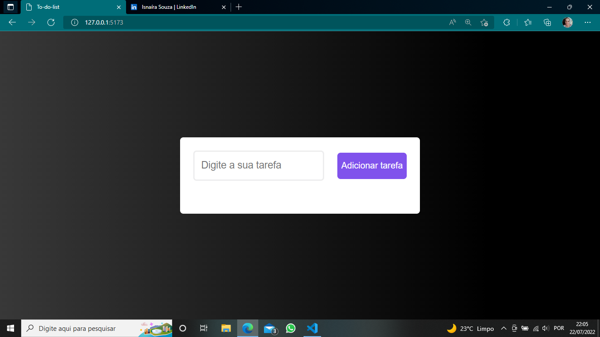
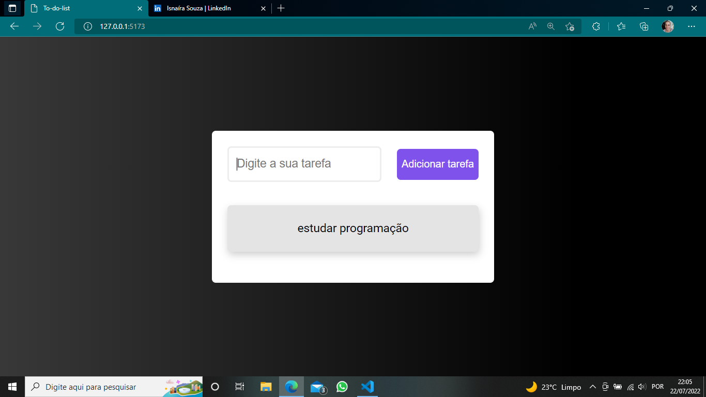

# TO-DO-LIST
 
React Project.

  
  

> It's a simple project made with React. Where a to-do list is added..

## 🤝👩🏻 Collaborator

<table>
  <tr>
    <td align="center">
      <a href="#">
         
        
          <b>Isnaíra Souza</b>
        
      </a>
    </td>
    
</table>